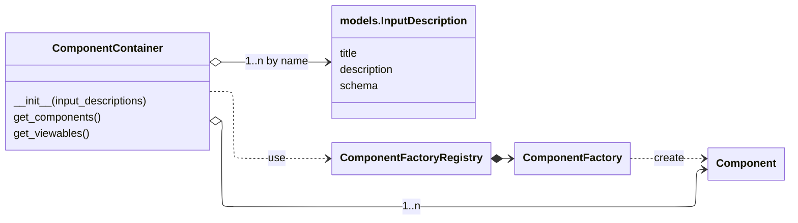
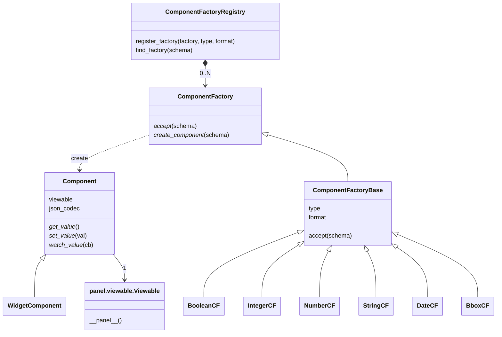
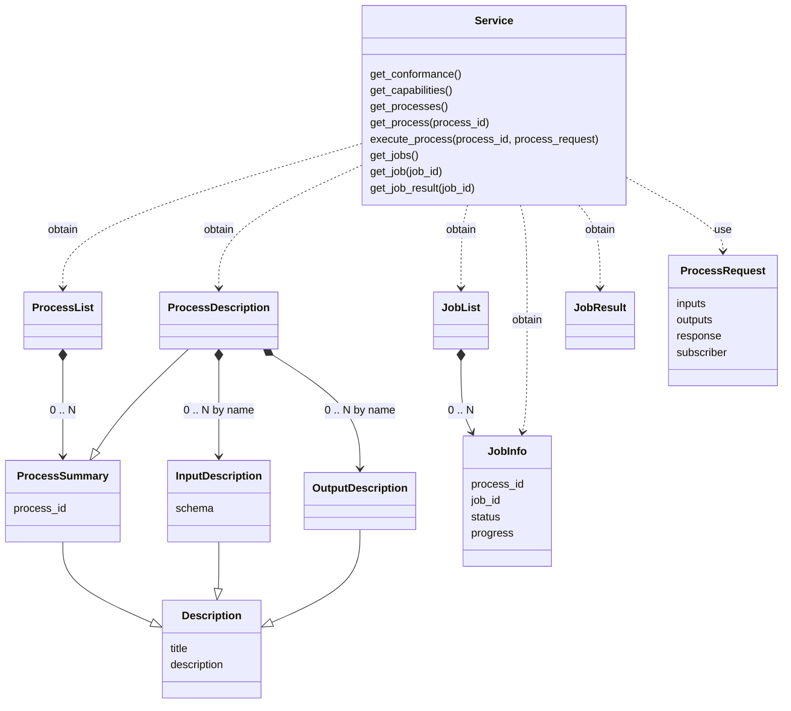
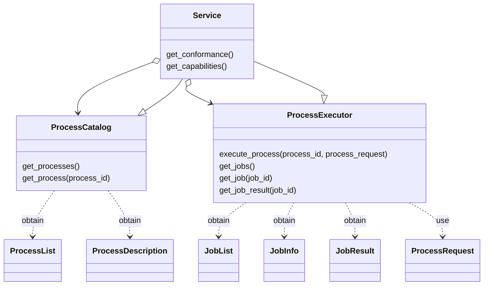
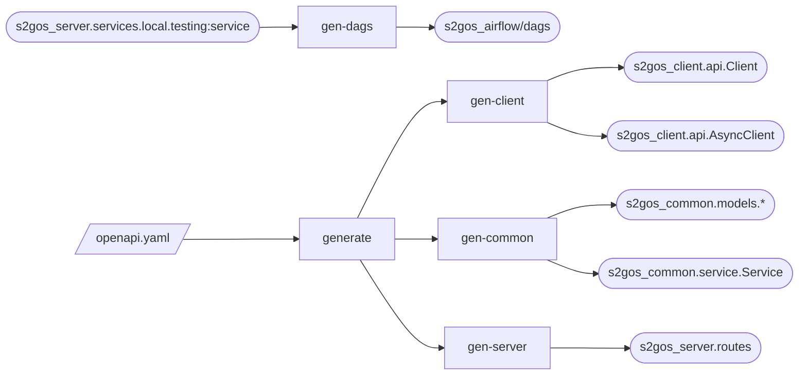

# Architecture

_Note, should the following diagram code not render, copy it 
into the [mermaid](https://www.mermaidchart.com/) editor._

## S2GOS Client - GUI

Given here is the design used in package `s2gos_client.gui.component`.
The package contains the code to generate widgets and panels from the 
JSON schema `s2gos_common.models.InputDescription` instances contained in
a `s2gos_common.models.ProcessDescription` instance.

The `ComponentContainer` maps every `InputDescription` to a visual 
`Component` that is created for a given JSON schema.  

A suitable `ComponentFactory` is selected for a given JSON schema
and will create the `Component` when it is needed.
The possible `ComponentFactory` instances are registered in a
 `ComponentFactoryRegistry` singleton.

## S2GOS Common

Given here is the design used in package `s2gos_common.service`.

which may be refined like so:

## Code generation

