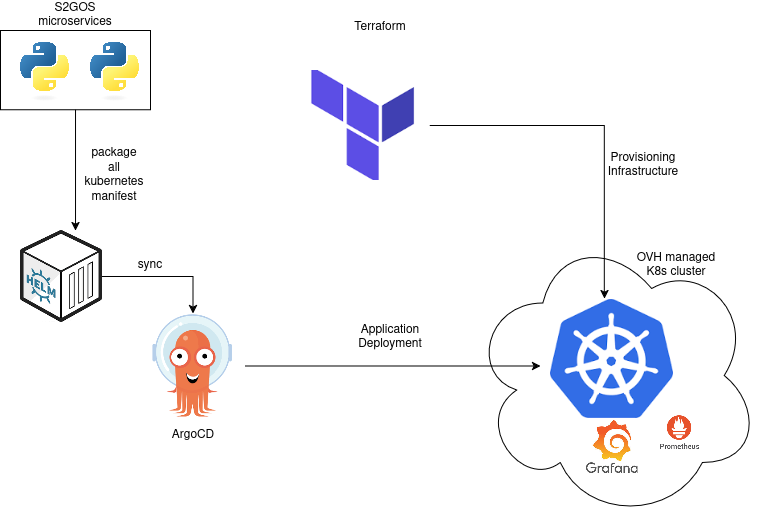

# DevOps Tools – High-Level Overview



To deliver and operate the S2GOS service efficiently, we apply modern DevOps practices.
These ensure that software is built, tested, and deployed in a reliable, repeatable, 
and secure way. The main tools can be grouped as follows: 

1. **Infrastructure & Deployment** 

- `Kubernetes` – the platform on which all services run. It allows applications 
   to scale automatically, restart when needed, and be isolated for reliability. 

- `Helm` – a package manager for Kubernetes. It makes deploying complex applications 
much simpler and ensures they can be installed the same way across different 
environments. 

- `Terraform` – used to set up the underlying cloud resources (servers, storage, 
networks). It guarantees that infrastructure is defined in code, so it can be 
  reproduced, audited, and updated consistently.

2. **Continuous Integration & Delivery (CI/CD)** 

- `GitHub Actions` – automates testing and building of the software whenever code 
changes are made. This reduces errors and speeds up development. 

- `ArgoCD` – ensures that what is defined in the project repositories is always 
reflected in the running system. It continuously monitors and synchronizes deployments, 
reducing manual intervention.

3. **Monitoring and Observability** 

- `Prometheus and Grafana` – provide live insights into the system’s health and 
performance (e.g., resource usage, response times). This allows early detection of 
issues and helps optimize resources. 

- `Jaeger` – used for tracing requests across services, which helps diagnose problems 
and improve efficiency of workflows. 

4. **Security and Access**

- `Keycloak` – a central system for user authentication and authorisation. 
   It enables single sign-on and ensures that only authorised users can access services.

- `Sealed Secrets` - allows us to store passwords and keys safely in Kubernetes without
   exposing them in plain text.

## Building the server image

The `s2gos-server` container image is built with the
[`build-image.sh`](https://github.com/s2gos-dev/s2gos-controller/blob/main/s2gos-server/build-image.sh)
script, which wraps `docker build` and pins the eozilla packages (`gavicore`,
`procodile`, `wraptile`) to a given version.

```commandline
# Build, tagging the image from the s2gos-server version:
./s2gos-server/build-image.sh

# Build with an explicit tag:
./s2gos-server/build-image.sh -t dev

# Build and push to the registry:
./s2gos-server/build-image.sh -t 0.2.0 --push

# Build against a specific eozilla version:
./s2gos-server/build-image.sh --eozilla-version 0.2.0.dev1
```

The image repository defaults to `quay.io/s2gos/s2gos-server`; override it with
`-r`/`--repo` or the `IMAGE_REPO` environment variable. Run
`./s2gos-server/build-image.sh --help` for the full list of options.
