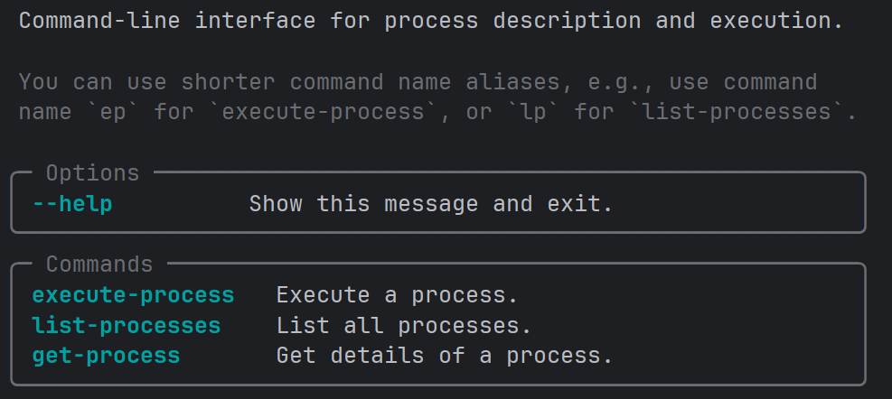

# Process Development

The package `s2gos_common` provides a simple **processor development framework** that

  - supports registration of processes from Python functions,  
  - supports progress reporting by subscriber callback URLs, and
  - provides a command-line interface (CLI) to query and execute 
    the registered processes.

Processor packages developed using the provided CLI can later on be used to
generate Docker images, Airflow DAGs, and optionally OGC Application Packages.

You find the processor framework in the `s2gos_common.processes` package. 
It comprises just a few handy top-level components:

* [class `ProcessRegistry`][s2gos_common.process.ProcessRegistry] - to register your 
  Python functions as processes in a central collection.
* [class `JobContext`][s2gos_common.process.JobContext] - used inside your process 
  implementations to report progress or check for client-side cancellation.  
* [function `get_cli()`][s2gos_common.process.get_cli] - generates a CLI for the 
  processes in the registry.


## Development Recipe

Framework usage is simple, it is a 3-step process: 

1. Populate process registry with processes derived from your Python functions.
2. Define a CLI instance from that process registry.
3. Define an entry point script for the CLI instance, so you can run your package 
   as an application.

The steps are explained in more detail in the following.

### 1. Populate process registry

First, you'll create a process registry object of type `ProcessRegistry`.
Use the registry's `process` decorator to register your Python functions 
that should be exposed as processes. In `my_package/processes.py`:

```python
from s2gos_common.process import JobContext, ProcessRegistry

registry = ProcessRegistry()


@registry.process(id="my-process-1")
def my_process_1(path: str, threshold: float = 0.5) -> str:
    ctx = JobContext.get()
    ...
    ctx.report_progress(progress=15, message="Initialized sources")
    ...


@registry.process(id="my-process-2")
def my_process_2(ctx: JobContext, path: str, factor: float = 1.0) -> str:
    ...
```

The `ctx` object of type [JobContext][s2gos_common.process.JobContext]
can be used to report progress and to check for job cancellation.
You can get the job context inside the function body via `JobContext.get()` 
or declare it as a function argument of type `JobContext`.

Process inputs, such as the arguments `path` or `factor` above, 
can be further specified by 
[`pydantic.Field`](https://docs.pydantic.dev/latest/concepts/fields/) annotations.
Field annotations for an argument can be provided via the `input_fields` dictionary 
passed  to the [`process`][s2gos_common.process.ProcessRegistry.process] decorator, 
or preferably as part of the type declaration using the Python `Annotated` 
special form. An example for the latter is
`factor: Annotated[float, Field(title="Scaling factor", gt=0., le=10.)] = 1.0`.

### 2. Define CLI instance

In a second step you define an instance of a common process CLI and pass it 
a reference to your registry instance. In `my_package/cli.py`:

```python
from s2gos_common.process.cli.cli import get_cli

# The CLI with a basic set of commands.
# The `cli` is a Typer application of type `typer.Typer()`,
# so can use the instance to register your own commands.
cli = get_cli("my_package.processes:registry")
```

You could also pass the imported registry directly, but using a 
reference string defers importing the registry instance until it is 
needed. This makes the CLI much faster if it is just called with
the `--help` option and hence no importing of yet unused libraries 
takes place. 

### 3. Define entry point script

In a last step you expose the CLI as an entry point script of your package. 
In your `pyproject.toml`:

```toml
[project.scripts]
my-tool = "my_package.cli:cli"
```

After installing `my_package` in a Python environment using `pip` or `pixi`
you can run your CLI as an executable and `my-tool --help` will output:



## Usage Example

### Example project setup

An application example that can serve as a starting point is provided in the workspace 
[s2gos-app-ex](https://github.com/s2gos-dev/s2gos-controller/tree/main/s2gos-app-ex). Please check out its `README.md` to install and run it.

The application's primary user interface is its simple, generated CLI 
(you can extend it, if you like). For the above application example the CLI tool
is named `s2gos-app-ex`. 

### Getting process information

Use `list-processes` (or short `lp`) subcommand to list the published processes, and use 
`get-process` (or short `gp`) to get the details like the inputs of your your process.
The command `s2gos-app-ex gp primes_between` will give you the input specs of the 
published process `primes_between`:

```json
{
  "title": "Prime Generator",
  "description": "Computes the list of prime numbers within an integer value range.",
  "id": "primes_between",
  "version": "0.0.0",
  "inputs": {
    "min_val": {
      "title": "Minimum value of search range",
      "minOccurs": 0,
      "schema": {
        "minimum": 0.0,
        "type": "integer",
        "default": 0
      }
    },
    "max_val": {
      "title": "Maximum value of search range",
      "minOccurs": 0,
      "schema": {
        "minimum": 0.0,
        "type": "integer",
        "default": 100
      }
    }
  },
  "outputs": {
    "return_value": {
      "title": "Return Value",
      "schema": {
        "type": "array",
        "items": {
          "type": "integer"
        }
      }
    }
  }
}
```

### Executing a process

To execute your processes, see help for the `execute-process` (or short `ep`) 
subcommand:  


### Execution request files

For larger or complex sets of input parameters it is recommended to use a 
_execution request file_ in JSON or YAML format. The structure is simple, for example:

```json
{
    "process_id": "primes_between",
    "inputs": {
      "min_val": 100,
      "max_val": 200
    }
}
```

The process request file format in detail:

- `process_id`: Process identifier
- `dotpath`: Whether dots in input names should be used to create
    nested object values. Defaults to `False`.
- `inputs`: Optional process inputs given as key-value mapping.
    Values may be of any JSON-serializable type accepted by
    the given process.
- `outputs`: Optional process outputs given as key-value mapping.
    Values are of type [Output][s2gos_common.models.Output] 
    and should be supported by the given process.
- `subscriber`: Optional object comprising callback
    URLs that are informed about process status changes
    while the processing takes place. The URLs are `successUri`,
    `inProgressUri`, and `failedUri` and none is required.
    See also [Subscriber][s2gos_common.models.Subscriber].


## Framework API

::: s2gos_common.process.ProcessRegistry
    options:
      show_source: false
      heading_level: 3

::: s2gos_common.process.Process
    options:
      show_source: false
      heading_level: 3

::: s2gos_common.process.JobContext
    options:
      show_source: false
      heading_level: 3

::: s2gos_common.process.JobCancelledException
    options:
      show_source: false
      heading_level: 3

::: s2gos_common.process.get_cli
    options:
      show_source: false
      heading_level: 3

::: s2gos_common.process.ExecutionRequest
    options:
      show_source: false
      heading_level: 3
