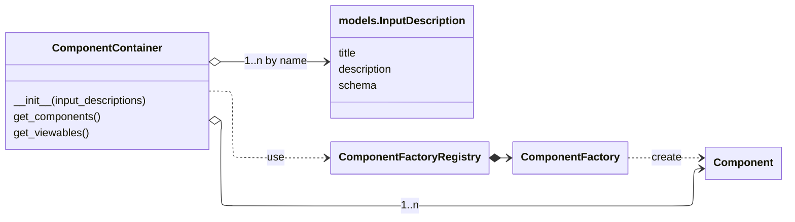
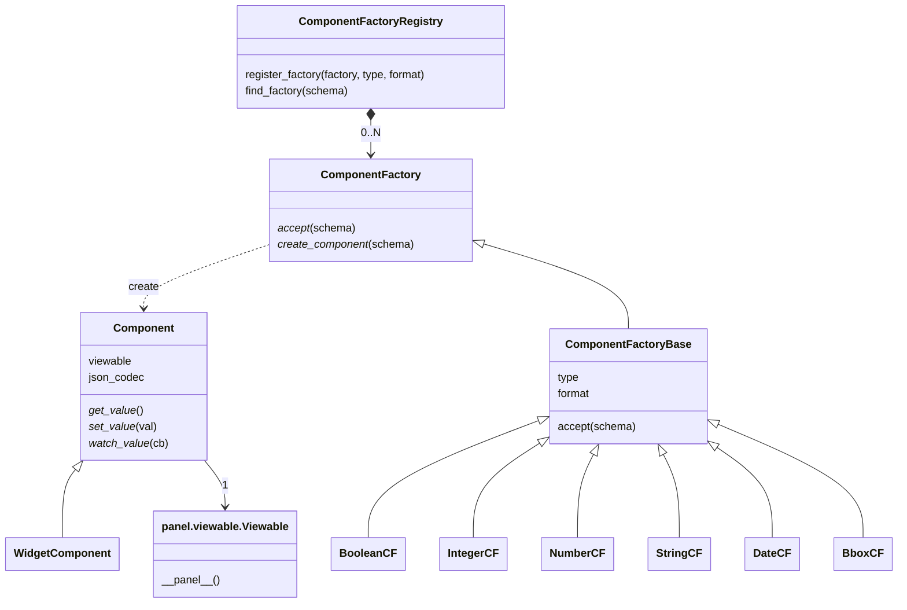

The design used in this package:

```mermaid
---
config:
  class:
    hideEmptyMembersBox: true
  layout: elk
---
classDiagram
direction LR
    class models.InputDescription {
      title
      description
      schema
    }
    class ComponentContainer {
	    \_\_init\_\_(input_descriptions)
      get_components()
      get_viewables()
    }
    ComponentContainer ..> ComponentFactoryRegistry : use
    ComponentContainer o--> models.InputDescription : 1..n by name
    ComponentContainer o--> Component : 1..n
    ComponentFactory ..> Component : create
    ComponentFactoryRegistry *--> ComponentFactory
```

```mermaid
---
config:
  class:
    hideEmptyMembersBox: true
  layout: dagre
---
classDiagram
direction TB
    class panel.viewable.Viewable {
	    \_\_panel\_\_()
    }
    class Component {
	    viewable
	    json_codec
	    _get_value_()
	    _set_value_(val)
	    _watch_value_(cb)
    }
    class WidgetComponent {
    }
    class ComponentFactory {
	    _accept_(schema)
	    _create_component_(schema)
    }
    class ComponentFactoryRegistry {
      register_factory(factory, type, format)
      find_factory(schema)
    }
    class ComponentFactoryBase {
	    type
	    format
	    accept(schema)
    }
    class BooleanCF {
    }
    class IntegerCF {
    }
    class NumberCF {
    }
    class StringCF {
    }
    class DateCF {
    }
    class BboxCF {
    }
    Component <|-- WidgetComponent
    Component --> panel.viewable.Viewable : 1 
    ComponentFactory ..> Component : create
    ComponentFactoryRegistry *--> ComponentFactory : 0..N
    ComponentFactory <|-- ComponentFactoryBase
    ComponentFactoryBase <|-- BooleanCF
    ComponentFactoryBase <|-- IntegerCF
    ComponentFactoryBase <|-- NumberCF
    ComponentFactoryBase <|-- StringCF
    ComponentFactoryBase <|-- DateCF
    ComponentFactoryBase <|-- BboxCF
```

Note, if the diagram isn't rendered, take the code 
to [mermaid](https://www.mermaidchart.com/).
